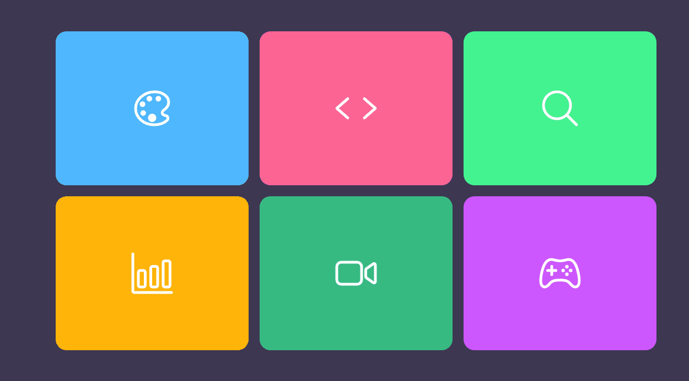

<h1 align="center"> CSS Animations </h1>

<!-- Preview -->
<div align="center">
  
</div>

<br/>
<!-- Sobre o Projeto -->

## 🧐 Sobre o Projeto

Esse projeto é construído apenas utilizando HTML e CSS, para estudo de conceitos de animações e sites responsivos.

## 🚀 Tecnologias e Bibliotecas

- HTML
- CSS

## 💻 Rodando o Projeto

```bash
# Realize o Clone deste repositório
$ https://github.com/lucasbarque/ServicesCSSAnimation.git
# ou use a opção de download.
# Acesse a pasta
$ cd ServicesCSSAnimation
# Abra o arquivo index.html no navegador de sua preferência
```

© 2022 GitHub, Inc.
Terms
Privacy
Security
Stat
